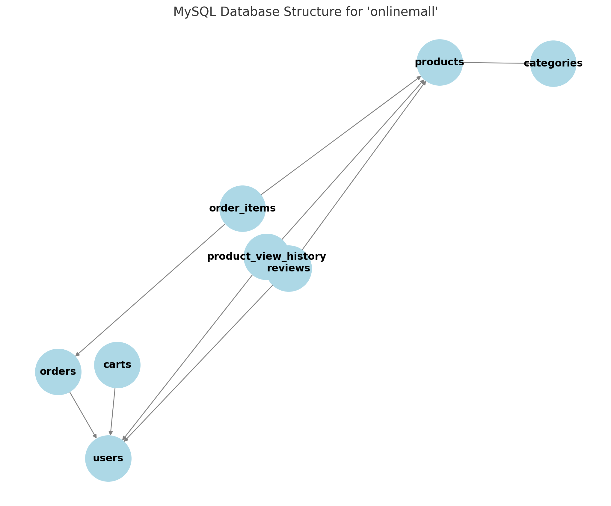

# [中文版本(Simplified Chinese version)](readme_zh_cn.md)

# [接口文档(Api docs)](https://g4kfvgyyq7.apifox.cn)

# 1. Project Features (Current Version: `1.5.3Beta`)

This project is similar to an e-commerce website and supports the following features:

- [x]  User registration and login
- [x]  Encrypted password storage
- [x]  Adding product categories
- [x]  Modifying user information
- [x]  Searching for products
- [x]  Viewing product details
- [x]  Viewing products under a specific category
- [x]  Commenting on products (add, delete, and view comments)
- [x]  Adding products to the shopping cart
- [x]  Retrieving all products in the shopping cart
- [x]  Searching for products in the shopping cart
- [x]  Basic order placement (returns an `order` object to the frontend)
- [ ]  Advanced order placement (affects product inventory and handles concurrency)
- [ ]  Ultimate order placement (simulating WeChat/Alipay payment callbacks based on advanced ordering)
- [x]  Nested comments
- [x]  Anonymous comments
- [x]  Browsing history tracking
- [x]  Merchant and administrator roles (can freely add or remove products)
- [ ]  Chat with AI assistant (using the ChatAI API)
- [ ]  Adding CAPTCHA for login (cost is a concern, may explore implementing 2FA)
- [ ]  Implementing caching (Redis cache)
- [x]  Designing a heat algorithm to display frequently viewed product categories on the homepage
- [ ]  Enabling user-customer service chat (may implement merchant, admin, and user clients using Python if time allows)
- [ ]  Deploying to a personal server for public access
- [ ]  Enhancing security (XSS, SQL injection, CSRF, etc.; SQL injection is already prevented by using placeholders in SQL queries)
- [ ]  Any other features you’d like to add (procrastination mode: ON)

# 2. Project Structure

## 2.1. File Structure Diagram

```go
OnlineMall
│
├── api                  // Stores all API endpoint definitions
│   ├── auth.go           // User authentication-related APIs
│   ├── cart.go           // Shopping cart-related APIs
│   ├── categories.go     // Product category-related APIs
│   ├── order.go          // Order management-related APIs
│   ├── product.go        // Product management-related APIs
│   ├── review.go         // Product review-related APIs
│   └── user.go           // User management-related APIs
│
├── auth                 // Handles authentication functionality
│   ├── check_permission.go  // Checks user permissions
│   └── jwt_generator.go     // Generates and parses JWT tokens
│
├── cmd                  // Contains application startup and initialization logic
│   └── start.go           // Starts the application and initializes services
│
├── dao                  // Database access layer
│   ├── db_connection.go  // Handles database connection
│   ├── cart.go           // Shopping cart data operations
│   ├── categories.go     // Product category data operations
│   ├── order.go          // Order data operations
│   ├── product.go        // Product data operations
│   ├── review.go         // Product review data operations
│   └── user.go           // User data operations
│
├── middleware           // Stores middleware, such as token validation
│   └── token_handler.go    // Handles token validation logic
│
├── model                // Stores data models
│   ├── auth.go           // User authentication model
│   ├── cart.go           // Shopping cart model
│   ├── order.go          // Order model
│   ├── products.go       // Product model
│   ├── review.go         // Product review model
│   ├── user.go           // User model
│   └── map_to_slice.go   // Key-value mapping model
│
├── respond              // Handles API response formatting
│   └── responses.go       // Defines a unified response format
│
├── routers              // Stores route configurations
│   └── router.go          // Configures all API routes
│
├── service              // Business logic layer
│   ├── auth.go           // User authentication-related business logic
│   ├── cart.go           // Shopping cart-related business logic
│   ├── categories.go     // Product category-related business logic
│   ├── order.go          // Order-related business logic
│   ├── product.go        // Product-related business logic
│   ├── review.go         // Product review-related business logic
│   └── user.go           // User-related business logic
│
├── utils                   // Utility functions
│   ├── if_in.go             // Utility functions for checking element existence in sequences
│   ├── pwd_encryption.go    // Password encryption utilities
│   ├── list_in_rank_out.go  // Takes a slice of numbers and returns their ranking
│   └── map_to_int_slice.go  // Converts a map into a slice of custom key-value structures
│ 
├── go.mod               // Go Modules configuration file
├── main.go              // Project entry point, responsible for starting the application
└── readme.md            // Project README file (this document)
```

## 2.2. Directory Details

1. **api**: Contains API definitions for different functionalities such as user authentication, shopping cart management, product categories, product management, order processing, and reviews. Each file corresponds to a specific module.
2. **auth**: Handles user authentication logic, primarily focusing on JWT generation and validation to ensure user identity legitimacy.
3. **cmd**: Contains the application's startup logic. `start.go` serves as the main entry point, responsible for loading configurations and launching the service.
4. **dao**: Data access layer, responsible for database interactions, including CRUD operations. For example, `cart.go` handles shopping cart-related database operations, while `order.go` manages order-related database operations.
5. **middleware**: Middleware layer, typically used for request pre-processing, such as token validation.
6. **model**: Defines data models that map to database tables. Each file represents a specific module's data structure, such as `cart.go` for the shopping cart model and `products.go` for the product model.
7. **respond**: Handles unified API response formatting, ensuring consistency in API return structures for easier frontend processing.
8. **routers**: Defines API routes and their corresponding handlers, managing request paths and logic.
9. **service**: Business logic layer that encapsulates core functionalities. For example, `cart.go` in the service layer handles shopping cart operations.
10. **utils**: Stores utility functions such as element checking and password encryption.
11. **go.mod**: Go Modules configuration file that specifies project dependencies and versions.
12. **main.go**: The main entry point of the project, responsible for initializing configurations and starting the application.
13. **readme.md**: The project's README file, providing basic information, usage instructions, and technology stack details.
14. **readme_zh_cn.md**: Simplified Chinese version of the` README` file (which is also the original version).

## 2.3. `MySQL` Table Structure

### 2.3.1. Structure Diagram



### 2.3.2. Structure Description

1. `users` (User Table)
   - Acts as the core table, storing basic information about users.
   - Other tables (such as `orders`, `carts`, `reviews`, `product_view_history`) are associated with users.
2. `products` (Product Table)
   - Stores detailed information about products.
   - Associated with the `categories` table (a product belongs to a category).
   - Associated with the `reviews` table (users can review products).
   - Associated with the `product_view_history` table (records the user's browsing history).
3. `categories` (Product Category Table)
   - Stores category information for products.
   - Linked to the `products` table through `category_id`.
4. `carts` (Shopping Cart Table)
   - Linked to the `users` table (each user has one cart).
   - Stores the products added to the cart by the user (usually associated with `product_id` from the `products` table).
5. `orders` (Order Table)
   - Linked to the `users` table (a user can have multiple orders).
   - Linked to the `order_items` table (an order contains multiple products).
6. `order_items` (Order Item Table)
   - Linked to the `orders` table (an order contains multiple items).
   - Linked to the `products` table (records the specific product information in the order).
7. `reviews` (Product Review Table)
   - Linked to the `users` table (reviews are submitted by users).
   - Linked to the `products` table (reviews are for a specific product).
8. `product_view_history` (Product View History Table)
   - Linked to the `users` table (records the user's browsing history).
   - Linked to the `products` table (stores the products viewed by the user).

### 2.3.3. Structure Summary

- One-to-Many:

  - One `users` can correspond to multiple `orders` (a user can have multiple orders).
  - One `orders` can correspond to multiple `order_items` (an order can contain multiple products).
  - One `products` can correspond to multiple `reviews` (a product can have multiple reviews).
  - One `users` can correspond to multiple `reviews` (a user can write multiple reviews).
  - One `categories` can correspond to multiple `products` (a category can have multiple products).
  - One `users` can correspond to multiple `product_view_history` (a user can have multiple view records).

- Many-to-Many

   (implemented through junction tables):

  - `orders` and `products` have a many-to-many relationship (through `order_items`).
  - `users` and `products` have a many-to-many relationship in `carts` (a user can add multiple products to the cart, and each product can be added to the cart by multiple users).

# 3. Definition of Status Codes

| Status Code | HTTP Status Code | Description                         | Reason                                                       | Solution                                                     |
| ----------- | ---------------- | ----------------------------------- | ------------------------------------------------------------ | ------------------------------------------------------------ |
| 20000       | 200              | Success                             | -                                                            | -                                                            |
| 40001       | 401              | Incorrect Username                  | The username provided during login is incorrect and does not match any user in the database. | Provide the correct username.                                |
| 40002       | 401              | Incorrect Password                  | The password provided during login is incorrect and does not match the existing records in the database. | Provide the correct password.                                |
| 40003       | 400              | Invalid Username                    | The username provided during registration already exists in the database. | Provide a unique username.                                   |
| 40004       | 400              | Missing Parameters                  | The number of parameters provided is less than required.     | Provide the required parameters.                             |
| 40005       | 400              | Incorrect Parameter Type            | The parameter type provided is incorrect, preventing it from binding to the structure. | Provide the correct parameter type.                          |
| 40006       | 400              | Parameter Too Long                  | A parameter provided exceeds the allowed length.             | Shorten the parameter length.                                |
| 40007       | 400              | Incorrect Username or Password      | The provided username or password is incorrect.              | Provide the correct username or password.                    |
| 40008       | 400              | Invalid Gender                      | The provided gender is not one of ("male", "female", "other"). | Provide one of the valid options.                            |
| 40009       | 401              | Missing Token                       | The JWT key is missing in the request header.                | Include the JWT key in the header.                           |
| 40010       | 401              | Invalid JWT Signature Method        | The JWT key format is incorrect.                             | Provide a valid JWT token.                                   |
| 40011       | 401              | Invalid Token                       | The JWT token is invalid.                                    | Provide a valid JWT token.                                   |
| 40012       | 401              | Invalid Claims                      | The claims in the JWT token are invalid.                     | Provide a valid JWT token.                                   |
| 40013       | 400              | Invalid User ID                     | The user ID provided for querying user information does not exist. | Provide a valid user ID.                                     |
| 40014       | 401              | Insufficient Permissions            | The user is neither an administrator nor a store owner.      | Have an administrator or store owner perform this action.    |
| 40015       | 404              | Category Not Found                  | The category ID provided when adding a product does not exist. | Provide a valid category ID.                                 |
| 40016       | 400              | Category Name Already Exists        | A duplicate category name was provided when adding a category. | Provide a unique category name.                              |
| 40017       | 404              | Product Not Found                   | Attempted to find a product by ID, but the product does not exist. | Provide a valid product ID.                                  |
| 40018       | 404              | Product Not Found                   | No product was found when searching by keyword.              | Provide an existing product keyword.                         |
| 40019       | 404              | Product List is Empty               | The product list is empty when displaying all products or a specific category. | If displaying all products, add products first. If filtering by category, provide a valid category ID. |
| 40020       | 401              | Invalid Refresh Token               | The provided refresh token is invalid when trying to refresh the access token. | Provide a valid refresh token. If expired, log in again.     |
| 40021       | 400              | Product Already in Cart             | The same product with the same quantity is already in the cart when trying to add it again. | If updating quantity, provide a different quantity; otherwise, choose another product. |
| 40022       | 400              | Quantity Too Large                  | The quantity provided when placing an order or adding a product to the cart exceeds 999. | Provide a quantity less than 999.                            |
| 50001       | 500              | Order Not Found                     | Internal error: order and product records do not match when verifying a purchase. | -                                                            |
| 40024       | 400              | User Has Not Purchased This Product | The user attempted to review a product they have not purchased. | Purchase the product before leaving a review.                |
| 40025       | 400              | User Already Reviewed               | The user attempted to review a product they have already reviewed. | Do not submit duplicate reviews.                             |
| 40026       | 400              | Rating Out of Range                 | The user provided a rating outside the 1-5 range.            | Provide a rating within the valid range.                     |
| 40027       | 400              | Review Too Long                     | The user's review exceeds the allowed character limit.       | Shorten the review text.                                     |
| 40028       | 400              | Parent Comment Not Found            | The parent comment ID provided when replying to a comment does not exist. | Provide a valid parent comment ID.                           |
| 40029       | 404              | Shopping Cart is Empty              | The user requested to display all items in the cart, but the cart is empty. | Add items to the cart before displaying.                     |
| 40030       | 404              | No Product Reviews                  | The user attempted to view reviews for a product, but no reviews exist. | Submit a review before retrieving reviews.                   |
| 40031       | 404              | No Matching Reviews                 | No reviews matching the search keyword were found when searching for product reviews. | Use a different keyword.                                     |
| 40032       | 404              | Review Not Found                    | The review ID provided for query or deletion does not exist. | Provide a valid review ID.                                   |

# 4. General Error Response Examples

Some errors returned by the project are generic, so I only saved their examples in the `apifox` API documentation during the early stages of the project. Later, I did not keep examples. Here, I list these error examples, and you can refer to the table above for their reasons:

## 4.1. Not Logged In

```json
{
    "status": "40009",
    "info": "missing token"
}
```

## 4.2. Invalid JWT Token Signing Method

```json
{
    "status": "40010",
    "info": "invalid signing method"
}
```

## 4.3. Invalid Token / Token Expired

```json
{
    "status": "40011",
    "info": "invalid token"
}
```

## 4.4. Invalid Token Claims

```json
{
    "status": "40012",
    "info": "invalid claims"
}
```

## 4.5. Insufficient Permissions

```json
{
    "status": "40014",
    "info": "unauthorized"
}
```

## 4.6. Missing Parameters

```json
{
    "status": "40004",
    "info": "missing param"
}
```

## 4.7. Incorrect Parameter Type

```json
{
    "status": "40005",
    "info": "wrong param type"
}
```

## 4.8. Parameter Too Long

```json
{
    "status": "40006",
    "info": "param too long"
}
```

# 5. Using the Project

## 5.1. Configure the Database

Please create a `mysql` database named `OnlineMall` with the password set to `123456`.

Then, create the 8 tables as described in section `2.3.2.Structure Description` above, using the following statements. **Create them one by one, in order**:

```mysql
CREATE TABLE `users` (
  `id` int NOT NULL AUTO_INCREMENT,
  `username` varchar(50) NOT NULL,
  `email` varchar(100) NOT NULL,
  `password` varchar(255) NOT NULL,
  `full_name` varchar(100) DEFAULT NULL,
  `phone_number` varchar(20) DEFAULT NULL,
  `nickname` varchar(50) DEFAULT NULL,
  `qq` varchar(20) DEFAULT NULL,
  `avatar` varchar(255) DEFAULT NULL,
  `gender` enum('male','female','other') DEFAULT 'other',
  `bio` text,
  `created_at` timestamp NULL DEFAULT CURRENT_TIMESTAMP,
  `updated_at` timestamp NULL DEFAULT CURRENT_TIMESTAMP ON UPDATE CURRENT_TIMESTAMP,
  `role` enum('user','merchant','admin') NOT NULL DEFAULT 'user',
  PRIMARY KEY (`id`),
  UNIQUE KEY `email` (`email`)
)
```

```mysql
CREATE TABLE `categories` (
  `id` int NOT NULL AUTO_INCREMENT,
  `name` varchar(50) NOT NULL,
  `description` text,
  PRIMARY KEY (`id`)
)
```

```mysql
CREATE TABLE `products` (
  `id` int NOT NULL AUTO_INCREMENT,
  `name` varchar(100) NOT NULL,
  `description` text,
  `price` decimal(10,2) NOT NULL,
  `stock` int NOT NULL DEFAULT '0',
  `category_id` int DEFAULT NULL,
  `popularity` int DEFAULT '0',
  `ave_rating` decimal(3,2) DEFAULT '0.00',
  `product_image` varchar(255) DEFAULT NULL,
  `created_at` timestamp NULL DEFAULT CURRENT_TIMESTAMP,
  `updated_at` timestamp NULL DEFAULT CURRENT_TIMESTAMP ON UPDATE CURRENT_TIMESTAMP,
  PRIMARY KEY (`id`),
  KEY `category_id` (`category_id`),
  CONSTRAINT `products_ibfk_1` FOREIGN KEY (`category_id`) REFERENCES `categories` (`id`)
)
```

```mysql
 CREATE TABLE `orders` (
  `id` int NOT NULL AUTO_INCREMENT,
  `user_id` int NOT NULL,
  `order_date` timestamp NULL DEFAULT CURRENT_TIMESTAMP,
  `status` enum('pending','completed','canceled') NOT NULL DEFAULT 'pending',
  `total_price` decimal(10,2) NOT NULL DEFAULT '0.00',
  `address` varchar(255) NOT NULL,
  PRIMARY KEY (`id`),
  KEY `user_id` (`user_id`),
  CONSTRAINT `orders_ibfk_1` FOREIGN KEY (`user_id`) REFERENCES `users` (`id`)
)
```

```mysql
CREATE TABLE `order_items` (
  `item_id` int NOT NULL AUTO_INCREMENT,
  `order_id` int NOT NULL,
  `product_id` int NOT NULL,
  `quantity` int NOT NULL,
  `price` decimal(10,2) NOT NULL,
  PRIMARY KEY (`item_id`),
  KEY `order_id` (`order_id`),
  KEY `product_id` (`product_id`),
  CONSTRAINT `order_items_ibfk_1` FOREIGN KEY (`order_id`) REFERENCES `orders` (`id`),
  CONSTRAINT `order_items_ibfk_2` FOREIGN KEY (`product_id`) REFERENCES `products` (`id`)
)
```

```mysql
 CREATE TABLE `reviews` (
  `id` int NOT NULL AUTO_INCREMENT,
  `user_id` int NOT NULL,
  `product_id` int NOT NULL,
  `parent_id` int DEFAULT NULL,
  `rating` int NOT NULL,
  `comment` text,
  `is_anonymous` tinyint(1) DEFAULT '0',
  `created_at` timestamp NULL DEFAULT CURRENT_TIMESTAMP,
  `updated_at` timestamp NULL DEFAULT CURRENT_TIMESTAMP ON UPDATE CURRENT_TIMESTAMP,
  PRIMARY KEY (`id`),
  KEY `user_id` (`user_id`),
  KEY `product_id` (`product_id`),
  KEY `parent_id` (`parent_id`),
  CONSTRAINT `reviews_ibfk_1` FOREIGN KEY (`user_id`) REFERENCES `users` (`id`),
  CONSTRAINT `reviews_ibfk_3` FOREIGN KEY (`parent_id`) REFERENCES `reviews` (`id`),
  CONSTRAINT `reviews_chk_1` CHECK (((`rating` = -(1)) or ((`rating` >= 1) and (`rating` <= 5))))
)
```

```mysql
CREATE TABLE `carts` (
  `id` int NOT NULL AUTO_INCREMENT,
  `user_id` int NOT NULL,
  `product_id` int NOT NULL,
  `quantity` int NOT NULL DEFAULT '1',
  `created_at` timestamp NULL DEFAULT CURRENT_TIMESTAMP,
  `updated_at` timestamp NULL DEFAULT CURRENT_TIMESTAMP ON UPDATE CURRENT_TIMESTAMP,
  PRIMARY KEY (`id`),
  KEY `user_id` (`user_id`),
  KEY `product_id` (`product_id`),
  CONSTRAINT `carts_ibfk_1` FOREIGN KEY (`user_id`) REFERENCES `users` (`id`),
  CONSTRAINT `carts_ibfk_2` FOREIGN KEY (`product_id`) REFERENCES `products` (`id`)
)
```

## 5.2. Start the Project

After deploying the project locally, run the following command in the terminal at the project root directory:

```bash
go mod tidy
```

This will tidy up the dependencies. Then, run:

```bash
go run main.go
```

This will start the project.